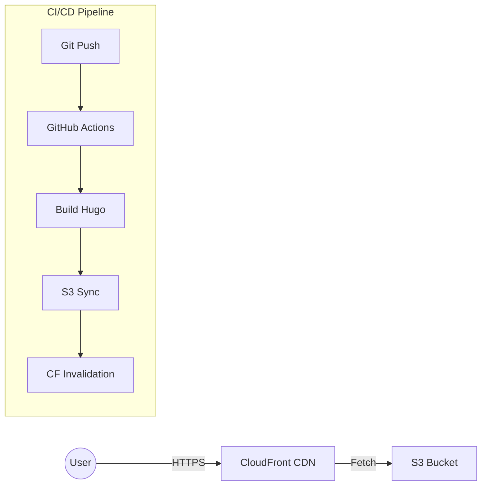

# 🚀 Cloud Native CV / DevOps Portfolio

Infrastructure-as-Code driven personal portfolio website. Built with **Hugo**, hosted on **AWS**, and deployed via **GitHub Actions**.

🔗 **Live:** [https://maksymenko.cv](https://maksymenko.cv)

## 🏗 System Architecture

The project follows a modern Serverless approach to host static content with global delivery.

